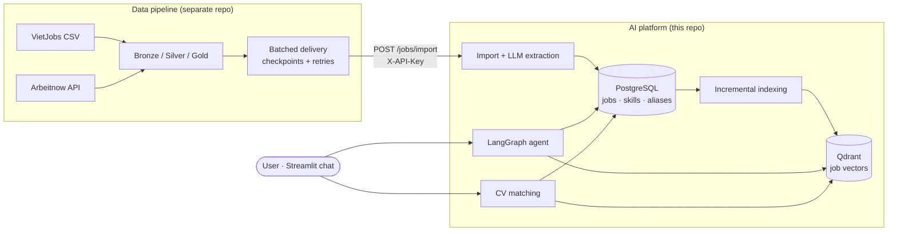
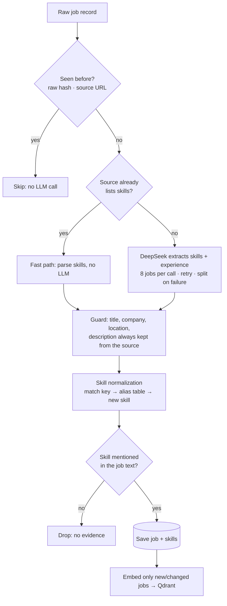
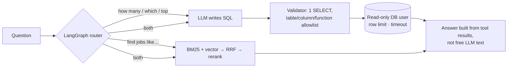
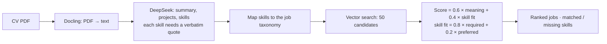

# AI Career Intelligence Platform

**Ask the job market a question, drop in your CV, get matched jobs and the skills you are missing.**

An LLM-powered job platform built on **1,081 real IT job postings** from Vietnam and Europe.
It extracts skills from raw job descriptions, searches jobs by meaning, answers analytics
questions in natural language with safe SQL, and scores a CV against every job.

[](https://github.com/levienbang/ai-career-platform/actions/workflows/ci.yml)


> Jobs arrive from a separate data-engineering pipeline:
> **[data-ingestion-preprocessing](https://github.com/levienbang/data-ingestion-preprocessing)**
> (VietJobs dataset + Arbeitnow API → Bronze/Silver/Gold → this platform).

---

## What you can do

| You do | The platform | Example |
|---|---|---|
| **Ask an analytics question** | Router picks SQL, LLM writes a query, a validator checks it, a read-only user runs it | *"Có bao nhiêu job thực tập?"* → `42` |
| **Search in plain words** | Keyword (BM25) + vector search, fused with RRF, optional LLM reranking | *"lập trình ứng dụng cho điện thoại chạy hệ điều hành của Google"* → Android jobs |
| **Drop a CV (PDF)** | Reads the PDF, extracts skills with evidence, ranks jobs by meaning **and** skill fit | Top jobs with matched / missing skills |
| **Check a skill gap** | Compares your skills with the jobs you picked | Required skills you lack, ranked by demand |

All of it is available through a FastAPI backend (`/docs`) and a **Streamlit chat demo**.

---

## How it works

### The big picture


```mermaid
flowchart LR
    subgraph DE["Data pipeline (separate repo)"]
        S1[VietJobs CSV] --> B[Bronze / Silver / Gold]
        S2[Arbeitnow API] --> B
        B --> D[Batched delivery<br/>checkpoints + retries]
    end

    D -- "POST /jobs/import<br/>X-API-Key" --> I

    subgraph AI["AI platform (this repo)"]
        I[Import + LLM extraction] --> PG[(PostgreSQL<br/>jobs · skills · aliases)]
        PG --> IX[Incremental indexing] --> QD[(Qdrant<br/>job vectors)]
        AG[LangGraph agent] --> PG
        AG --> QD
        CV[CV matching] --> PG
        CV --> QD
    end

    U([User · Streamlit chat]) --> AG
    U --> CV
```

### Importing a job: from raw text to clean, searchable data


```mermaid
flowchart TD
    A[Raw job record] --> B{Seen before?<br/>raw hash · source URL}
    B -- yes --> SKIP[Skip: no LLM call]
    B -- no --> C{Source already<br/>lists skills?}
    C -- yes --> FAST[Fast path: parse skills, no LLM]
    C -- no --> LLM[DeepSeek extracts skills + experience<br/>8 jobs per call · retry · split on failure]
    FAST --> G
    LLM --> G[Guard: title, company, location,<br/>description always kept from the source]
    G --> N[Skill normalization<br/>match key → alias table → new skill]
    N --> E{Skill mentioned<br/>in the job text?}
    E -- no --> DROP[Drop: no evidence]
    E -- yes --> DB[(Save job + skills)]
    DB --> IDX[Embed only new/changed jobs → Qdrant]
```

### Answering a question


```mermaid
flowchart LR
    Q[Question] --> R{LangGraph router}
    R -- "how many / which / top" --> SQL[LLM writes SQL]
    SQL --> V[Validator: 1 SELECT,<br/>table/column/function allowlist]
    V --> RO[(Read-only DB user<br/>row limit · timeout)]
    R -- "find jobs like…" --> H[BM25 + vector → RRF → rerank]
    R -- both --> SQL
    R -- both --> H
    RO --> ANS[Answer built from tool results,<br/>not free LLM text]
    H --> ANS
```

### Matching a CV


```mermaid
flowchart LR
    PDF[CV PDF] --> T[Docling: PDF → text]
    T --> X[DeepSeek: summary, projects, skills<br/>each skill needs a verbatim quote]
    X --> SK[Map skills to the job taxonomy]
    SK --> VS[Vector search: 50 candidates]
    VS --> S["Score = 0.6 × meaning + 0.4 × skill fit<br/>skill fit = 0.8 × required + 0.2 × preferred"]
    S --> OUT[Ranked jobs · matched / missing skills]
```

---

## Results on real data

Measured on the 941 real VietJobs IT jobs loaded at evaluation time, with rule-based labels
([`evaluation/real_cases.json`](evaluation/real_cases.json), script
[`evaluation/evaluate_real_data.py`](evaluation/evaluate_real_data.py)):

| Check | Result |
|---|---|
| Router picks the right tool (SQL / search / both) | **12 / 12** |
| Generated SQL returns the right number | **5 / 5** (all queries validated read-only) |
| Search, query names the skill — precision@5 | BM25 0.98 · vector 1.00 · hybrid 1.00 |
| Search, query **paraphrased** (no skill names) — precision@5 | BM25 **0.34** · vector **0.88** · hybrid 0.72 |

**What the numbers say:** keyword search collapses when users describe a job instead of naming
the skill ("phone OS made by Google" shares no words with "Android"); vector search keeps working. Equal-weight RRF lets
BM25 noise into the top 5, so the next step is weighting the fusion or reranking — and measuring it.

---

## Engineering highlights

- **The LLM is never trusted blindly.** Extracted skills must appear in the job text; company,
  title and description always come from the source; CV skills need a verbatim quote.
- **Safe text-to-SQL.** One `SELECT` parsed with `sqlglot`, allowlisted tables/columns/functions,
  a read-only database user, row limit and statement timeout.
- **Skill normalization in three cost tiers:** a match key (`Scikit-learn` = `scikit learn`) →
  a curated alias file → LLM alias learning with confidence thresholds, a blocklist and human review.
- **Pay once.** Duplicates are dropped *before* the LLM, indexing only embeds new or changed jobs,
  and alias decisions are cached.
- **Fails loudly, recovers safely.** Bounded retries for transient errors only, batch splitting to
  isolate a bad record, resumable indexing, idempotent imports.
- **Ready for the public internet.** Admin key for writes, per-client and daily limits on routes
  that spend paid API calls, password-gated demo.
- **323 offline tests** in CI (fake LLM/embeddings, SQLite, in-memory Qdrant) — no keys, no cost.

---

## Quick start

```bash
cp .env.example .env            # add DEEPSEEK_API_KEY and EMBEDDING_API_KEY (Google)
docker compose up --build -d    # API + PostgreSQL + Qdrant
docker compose exec api python -m scripts.load_demo_jobs   # demo corpus (or import real jobs)
docker compose exec api python -m scripts.index_jobs

cd demo && uv run streamlit run app.py    # chat UI → http://localhost:8501
```

API docs: <http://localhost:8000/docs>. Real jobs come from the
[pipeline repo](https://github.com/levienbang/data-ingestion-preprocessing) via `POST /jobs/import`.

## Tech stack

| Layer | Tools |
|---|---|
| API | FastAPI, Pydantic, SQLAlchemy, Alembic |
| Data | PostgreSQL 17, Qdrant |
| AI | DeepSeek (`deepseek-v4-flash`) via LangChain, Google `gemini-embedding-001`, LangGraph, Docling, sqlglot |
| UI | Streamlit |
| Ops | Docker Compose, uv, Ruff, Pytest, GitHub Actions |

## Project layout

```
app/
  api/         HTTP routes (thin)
  ingestion/   import pipeline: dedup → extraction → normalization → persist
  retrieval/   BM25, dense, RRF fusion, reranker, Qdrant indexing
  cv/          PDF → text → extraction → skill gap → job matching
  skills/      taxonomy, alias learning, human review
  graph/ tools/  LangGraph agent, SQL and search tools
scripts/       operations: sync skills, index, learn/review aliases
evaluation/    labelled cases and evaluation scripts
demo/          Streamlit chat
```

## Known limitations

- Import is synchronous; at high volume it should move to a queue with background workers.
- BM25 scores every job per query; a full-text index would be needed at scale.
- Job expiry is not modelled yet; closed postings stay searchable.
- Rate limits are in memory (one API process); behind the demo they act as one global limit.

---

**Deeper details** — settings, design decisions, milestone notes: [docs/REFERENCE.md](docs/REFERENCE.md) ·
deploy: [docs/DEPLOY.md](docs/DEPLOY.md) · scripts: [scripts/README.md](scripts/README.md) · demo: [demo/README.md](demo/README.md)
