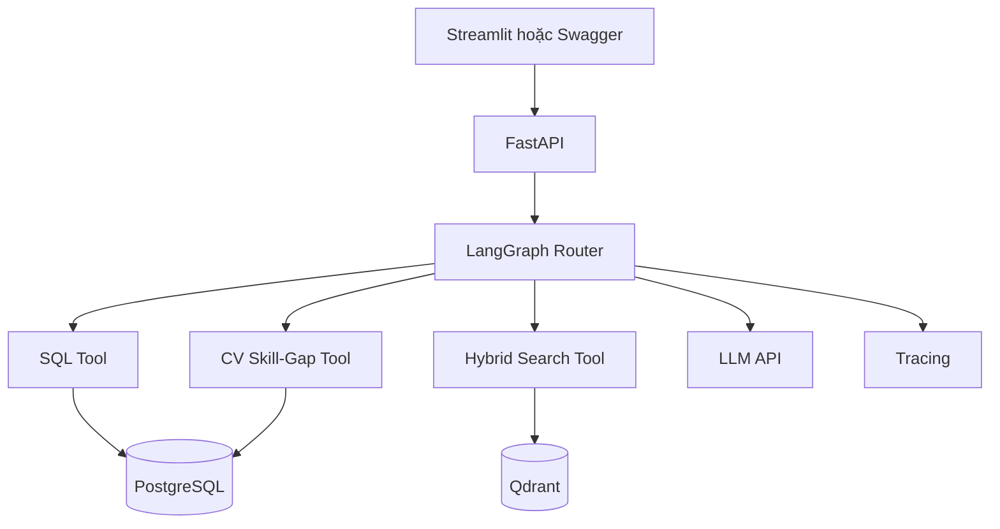
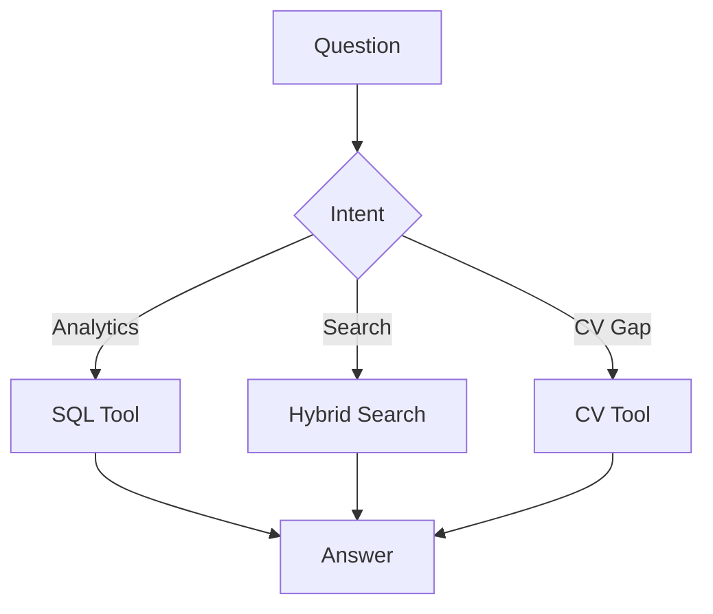

# AI Career Intelligence Platform

## 1. Tổng quan

**Tên dự án:** AI Career Intelligence & Skill-Gap Agent  
**Loại:** AI Engineer capstone project  
**Thời gian dự kiến:** 6–7 tuần, khoảng 80–110 giờ  
**Người dùng chính:** Cá nhân người phát triển đang tìm internship hoặc vị trí AI Engineer  

AI Career Intelligence Platform là hệ thống phân tích tin tuyển dụng bằng LLM, SQL và tìm kiếm ngữ nghĩa. Hệ thống cho phép người dùng đặt câu hỏi bằng ngôn ngữ tự nhiên, tìm công việc phù hợp, phân tích yêu cầu kỹ năng và đối chiếu CV với thị trường tuyển dụng.

Mục tiêu của dự án không phải xây một website tuyển dụng hoàn chỉnh. Đây là một project tập trung vào các năng lực cốt lõi của AI Engineer:

- Data ingestion và structured extraction.
- PostgreSQL và SQL analytics.
- Embedding, vector database và RAG.
- Dense search, sparse search, hybrid retrieval và reranking.
- Tool calling bằng LangChain.
- Workflow, routing và state bằng LangGraph.
- CV parsing và skill-gap analysis ở mức tối giản.
- FastAPI, Docker, testing, tracing và evaluation.

---

## 2. Bài toán

Tin tuyển dụng thường có cấu trúc không đồng nhất. Cùng một kỹ năng có thể được viết theo nhiều cách, ví dụ:

```text
PostgreSQL
Postgres
Postgre SQL
relational database experience
```

Người tìm việc gặp khó khăn khi muốn trả lời những câu hỏi như:

- Có bao nhiêu job AI Engineer yêu cầu Docker?
- Những kỹ năng nào xuất hiện thường xuyên nhất?
- Tìm các công việc phù hợp với người biết Python và Computer Vision.
- Công việc nào gần với project action recognition của tôi?
- CV hiện tại còn thiếu kỹ năng gì so với AI Engineer Intern?
- LangChain thường được yêu cầu cùng những công nghệ nào?

Các câu hỏi trên không thể giải quyết tốt bằng một phương pháp duy nhất:

- Câu hỏi thống kê chính xác cần PostgreSQL và SQL.
- Câu hỏi tìm kiếm theo ý nghĩa cần embedding và vector search.
- Một số câu hỏi cần phối hợp nhiều công cụ.
- Câu trả lời cuối phải dựa trên kết quả tool, không để LLM tự đoán.

---

## 3. Mục tiêu học tập

Sau khi hoàn thành, người phát triển cần có khả năng:

1. Thiết kế một LLM application từ ingestion đến deployment.
2. Dùng LLM structured output và Pydantic validation.
3. Thiết kế schema PostgreSQL cho job và skill.
4. Hiểu embedding, vector search và metadata filtering.
5. So sánh keyword, dense, hybrid và reranked retrieval.
6. Viết SQL tool an toàn, chỉ cho phép truy vấn đọc.
7. Đóng gói các chức năng thành LangChain tools.
8. Dùng LangGraph để định tuyến giữa SQL và vector search.
9. Quản lý state, retry, fallback và giới hạn vòng lặp.
10. Xây FastAPI backend và Docker Compose.
11. Đánh giá retrieval, routing, SQL và latency.
12. Trace và phân tích failure case của agent.

---

## 4. Phạm vi đã chốt

## 4.1. Chức năng cốt lõi bắt buộc

### A. Job ingestion

- Import job từ CSV/JSON hoặc dataset công khai.
- Làm sạch và loại bỏ bản ghi trùng.
- Trích xuất thông tin có cấu trúc từ job description.
- Kiểm tra kết quả bằng Pydantic.
- Lưu dữ liệu vào PostgreSQL.
- Tạo embedding và index vào Qdrant.

### B. Job analytics bằng SQL

- Đếm số lượng job theo title, location và experience level.
- Thống kê tần suất kỹ năng.
- So sánh yêu cầu giữa các nhóm vị trí.
- Phân tích những kỹ năng thường xuất hiện cùng nhau.
- Cho phép người dùng hỏi bằng ngôn ngữ tự nhiên.

### C. Semantic và hybrid job search

- Keyword hoặc sparse retrieval.
- Dense semantic retrieval.
- Metadata filtering.
- Hybrid fusion.
- Reranking top candidates.
- So sánh các phương pháp bằng metric retrieval.

### D. LangChain tools

Tối thiểu có hai tool chính:

```text
SQL Analytics Tool
Hybrid Job Search Tool
```

Một tool tùy chọn nhưng nên có:

```text
CV Skill-Gap Tool
```

### E. LangGraph agent

- Phân loại ý định câu hỏi.
- Chọn SQL tool hoặc vector-search tool.
- Hỗ trợ một số câu hỏi cần phối hợp hai tool.
- Tổng hợp evidence thành câu trả lời.
- Retry khi tool gặp lỗi tạm thời.
- Fallback khi dữ liệu không đủ.
- Giới hạn số vòng lặp.

### F. CV skill-gap tối giản

- Đọc một CV PDF.
- Trích xuất danh sách kỹ năng.
- So sánh với tập job mục tiêu.
- Trả về kỹ năng đã có, kỹ năng còn thiếu và mức độ phổ biến.

### G. Productization

- FastAPI backend.
- Streamlit UI đơn giản hoặc Swagger UI đủ để demo.
- Docker Compose.
- Unit test và integration test cho luồng chính.
- Tracing bằng LangSmith hoặc Langfuse.
- Evaluation set 30–50 case.

## 4.2. Future Work — chưa thực hiện

Các phần sau không thuộc scope chính:

- Application tracking.
- CRUD trạng thái ứng tuyển.
- Quản lý nhiều CV version.
- Authentication phức tạp.
- Redis và background queue nếu dataset nhỏ.
- Web crawling hàng loạt.
- Tự động nộp đơn hoặc gửi email.
- Multi-agent phức tạp.
- Fine-tuning LLM.
- Knowledge graph.
- Kafka hoặc Kubernetes.
- Hệ thống learning management.
- Bộ evaluation trên 100 câu trong phiên bản đầu.

---

## 5. Use cases chính

### Use case 1: SQL analytics

**Câu hỏi:**

> Bao nhiêu phần trăm job AI Engineer yêu cầu Docker?

**Luồng:**

```text
Question
→ Intent router
→ SQL generation
→ SQL safety validation
→ PostgreSQL
→ Result
→ Natural-language explanation
```

### Use case 2: Semantic search

**Câu hỏi:**

> Tìm việc phù hợp với người có project Computer Vision và Python nhưng chưa có kinh nghiệm production.

**Luồng:**

```text
Question
→ Query extraction
→ Dense + sparse retrieval
→ Metadata filtering
→ Fusion
→ Reranker
→ Top jobs
→ Explanation
```

### Use case 3: Multi-tool query

**Câu hỏi:**

> Tìm những công việc Computer Vision phù hợp với fresher, sau đó cho biết kỹ năng nào phổ biến nhất trong nhóm đó.

**Luồng:**

```text
Semantic search xác định tập job
→ Analytics tính skill trên tập kết quả
→ Agent tổng hợp
```

### Use case 4: CV skill gap

**Câu hỏi:**

> So với các vị trí AI Engineer Intern, CV của tôi còn thiếu gì?

**Luồng:**

```text
CV PDF
→ Parse text
→ Extract skills
→ Select target jobs
→ Aggregate market skills
→ Compare
→ Skill-gap report
```

---

## 6. Kiến trúc hệ thống



## 6.1. Offline ingestion

```text
Raw dataset
→ Cleaning
→ Deduplication
→ Structured extraction
→ Pydantic validation
→ PostgreSQL
→ Embedding
→ Qdrant
```

## 6.2. Online query

```text
User question
→ Intent classification
→ Tool routing
→ Tool execution
→ Evidence collection
→ Answer generation
```

---

## 7. Công nghệ

| Thành phần | Công nghệ | Vai trò |
|---|---|---|
| Ngôn ngữ | Python | Backend và AI pipeline |
| LLM integration | LangChain | Model, prompt, structured output, tools |
| Workflow | LangGraph | Routing, state, retry và fallback |
| API | FastAPI | Backend service |
| Validation | Pydantic | Schema và kiểm tra dữ liệu |
| Relational DB | PostgreSQL | Job, skill và analytics |
| ORM/migration | SQLAlchemy, Alembic | Database access và migration |
| Vector DB | Qdrant | Dense/hybrid retrieval |
| PDF parsing | Docling | Đọc CV PDF |
| Embedding | BGE-M3 hoặc embedding API | Semantic representation |
| Reranking | BGE Reranker hoặc rerank API | Xếp hạng lại kết quả |
| Tracing | LangSmith hoặc Langfuse | Debug agent/tool calls |
| Testing | Pytest | Unit và integration test |
| UI | Streamlit | Demo tối giản |
| Deployment | Docker Compose | Chạy reproducible |

## 7.1. Công nghệ chưa cần dùng ngay

```text
Redis
Celery/RQ
Kubernetes
Kafka
Airflow
Fine-tuning
Multi-agent
```

Chỉ thêm khi có vấn đề thực tế yêu cầu chúng.

---

## 8. Dữ liệu

Nguồn khởi đầu có thể sử dụng VietJobs hoặc một dataset tuyển dụng công khai khác. Chỉ cần lọc những nhóm liên quan:

```text
AI Engineer
Machine Learning Engineer
Computer Vision Engineer
NLP Engineer
Data Scientist
Backend/Platform roles liên quan AI
```

Không cần xử lý toàn bộ dataset trong giai đoạn đầu. Có thể bắt đầu với 500–2.000 job để hoàn thiện pipeline trước.

## 8.1. Job schema

```json
{
  "title": "AI Engineer",
  "company": "Example Company",
  "location": "Ho Chi Minh City",
  "employment_type": "Internship",
  "experience_years_min": 0,
  "required_skills": ["Python", "Docker", "FastAPI"],
  "preferred_skills": ["LangChain", "AWS"],
  "description": "...",
  "source_url": "..."
}
```

## 8.2. Skill normalization

Cần xây alias map tối thiểu:

```text
postgres, postgresql, postgre sql → PostgreSQL
fast api, fastapi → FastAPI
lang chain, langchain → LangChain
computer vision, cv → Computer Vision
```

Không để LLM tự quyết hoàn toàn taxonomy. Alias và canonical skill cần được lưu và kiểm thử.

---

## 9. Database sơ bộ

### `jobs`

```text
id
title
company_id
location
employment_type
description
experience_years_min
source_url
posted_at
ingested_at
content_hash
```

### `companies`

```text
id
name
industry
location
website
```

### `skills`

```text
id
canonical_name
category
```

### `skill_aliases`

```text
id
skill_id
alias
```

### `job_skills`

```text
job_id
skill_id
requirement_type
importance
evidence_text
```

`requirement_type`:

```text
required
preferred
inferred
```

### `candidate_profiles`

```text
id
parsed_profile_json
created_at
updated_at
```

### `candidate_skills`

```text
candidate_id
skill_id
evidence_text
confidence
```

Không cần bảng `applications` trong phiên bản này.

---

## 10. Retrieval pipeline

## 10.1. Baseline

Xây lần lượt:

1. Keyword search.
2. Dense vector search.
3. Hybrid search.
4. Hybrid search + reranker.

Không triển khai tất cả cùng lúc. Mỗi phiên bản phải có metric trước khi chuyển tiếp.

## 10.2. Luồng đề xuất

```text
Query
 ├── Dense retrieval
 ├── Sparse/keyword retrieval
 └── Metadata filters
          ↓
        Fusion
          ↓
        Top 20
          ↓
       Reranker
          ↓
        Top 5
```

## 10.3. Metadata cần lưu trong Qdrant

```json
{
  "job_id": 123,
  "title": "AI Engineer",
  "company": "Example",
  "location": "Ho Chi Minh City",
  "employment_type": "Internship",
  "experience_years_min": 0
}
```

---

## 11. LangChain tools

## 11.1. SQL Analytics Tool

Input:

```json
{
  "question": "Bao nhiêu job yêu cầu Docker?"
}
```

Output:

```json
{
  "sql": "SELECT ...",
  "columns": ["count"],
  "rows": [[125]],
  "row_count": 1
}
```

Yêu cầu an toàn:

- Chỉ cho phép `SELECT` và `WITH ... SELECT`.
- Chặn nhiều statement.
- Chặn `INSERT`, `UPDATE`, `DELETE`, `DROP`, `ALTER`, `TRUNCATE`.
- Allowlist bảng và cột.
- Giới hạn số dòng trả về.
- Timeout truy vấn.

## 11.2. Hybrid Job Search Tool

Input:

```json
{
  "query": "computer vision internship for fresher",
  "location": "Ho Chi Minh City",
  "top_k": 5
}
```

Output:

```json
{
  "jobs": [
    {
      "job_id": 123,
      "score": 0.87,
      "title": "Computer Vision Intern",
      "evidence": "..."
    }
  ]
}
```

## 11.3. CV Skill-Gap Tool

Input:

```json
{
  "profile_id": 1,
  "target_query": "AI Engineer Intern"
}
```

Output:

```json
{
  "available_skills": ["Python", "Machine Learning"],
  "missing_skills": [
    {"skill": "Docker", "frequency": 0.62},
    {"skill": "FastAPI", "frequency": 0.48}
  ]
}
```

---

## 12. LangGraph workflow

## 12.1. State

```python
class AgentState(TypedDict):
    query: str
    intent: str
    filters: dict
    sql_result: list
    retrieved_jobs: list
    cv_profile: dict | None
    evidence: list
    answer: str
    retry_count: int
    errors: list
```

## 12.2. Nodes

```text
classify_intent
extract_filters
run_sql_tool
run_search_tool
run_cv_tool
combine_evidence
generate_answer
fallback
```

## 12.3. Routing



Phiên bản nâng cao có thể thêm multi-tool route, nhưng chỉ sau khi ba nhánh đơn chạy ổn.

---

## 13. API dự kiến

### Job

```text
POST /jobs/import
GET  /jobs
GET  /jobs/{job_id}
```

### Search và analytics

```text
POST /search/keyword
POST /search/semantic
POST /search/hybrid
POST /analytics/query
GET  /analytics/top-skills
```

### CV

```text
POST /cv/upload
GET  /cv/{profile_id}
POST /cv/{profile_id}/skill-gap
```

### Agent

```text
POST /agent/query
```

### System

```text
GET /health
GET /ready
```

---

## 14. Cấu trúc repository

```text
ai-career-platform/
├── docs/
│   └── PROJECT_SPEC.md
├── app/
│   ├── main.py
│   ├── config.py
│   ├── api/
│   │   ├── jobs.py
│   │   ├── search.py
│   │   ├── analytics.py
│   │   ├── cv.py
│   │   └── agent.py
│   ├── ingestion/
│   │   ├── loader.py
│   │   ├── cleaner.py
│   │   ├── extractor.py
│   │   └── indexer.py
│   ├── retrieval/
│   │   ├── embeddings.py
│   │   ├── keyword.py
│   │   ├── dense.py
│   │   ├── hybrid.py
│   │   └── reranker.py
│   ├── graph/
│   │   ├── state.py
│   │   ├── nodes.py
│   │   ├── routes.py
│   │   └── builder.py
│   ├── tools/
│   │   ├── sql_tool.py
│   │   ├── search_tool.py
│   │   └── cv_tool.py
│   ├── services/
│   │   ├── matching.py
│   │   └── skill_gap.py
│   ├── db/
│   │   ├── models.py
│   │   ├── session.py
│   │   └── repositories.py
│   ├── schemas/
│   └── prompts/
├── evaluation/
│   ├── dataset.jsonl
│   ├── evaluate_retrieval.py
│   ├── evaluate_routing.py
│   └── evaluate_sql.py
├── tests/
│   ├── unit/
│   └── integration/
├── ui/
├── migrations/
├── docker-compose.yml
├── Dockerfile
├── pyproject.toml
├── .env.example
└── README.md
```

---

## 15. Evaluation plan đã thu gọn

## 15.1. Số lượng test case

| Nhóm | MVP | Portfolio |
|---|---:|---:|
| SQL analytics | 5 | 10 |
| Retrieval | 10 | 15 |
| Agent routing | 10 | 15 |
| CV skill gap | 0–5 | 5 |
| Error/unanswerable | 5 | 5 |
| **Tổng** | **30–35** | **50** |

Không đặt mục tiêu 100 case trong phiên bản đầu.

## 15.2. Metrics bắt buộc

### Retrieval

- Recall@5.
- MRR hoặc nDCG.
- Latency.

So sánh:

```text
Keyword
vs. Dense
vs. Hybrid
vs. Hybrid + Reranker
```

### Agent routing

- Intent accuracy.
- Tool selection accuracy.
- Task success rate.

### SQL

- Executable SQL rate.
- Exact-result accuracy.
- Unsafe-query rejection rate.

### System

- P50/P95 latency.
- Token usage hoặc chi phí ước tính.
- Error rate.

## 15.3. Tracing và evaluation framework

- Dùng LangSmith hoặc Langfuse tracing sớm để debug.
- Chưa bắt buộc dùng Ragas trong MVP.
- Custom metrics và ground truth nhỏ quan trọng hơn việc thêm nhiều framework.
- Ragas chỉ thêm sau nếu cần đánh giá faithfulness hoặc answer relevance.

---

## 16. Testing

### Unit tests

- Pydantic schema validation.
- Skill normalization.
- SQL safety validator.
- Query routing.
- Metadata filter construction.
- Fusion/ranking logic.

### Integration tests

- PostgreSQL repository.
- Qdrant indexing và search.
- FastAPI endpoints.
- LangGraph tool execution.

### End-to-end test

```text
Import job
→ Validate
→ Store PostgreSQL
→ Index Qdrant
→ Query agent
→ Correct tool
→ Grounded answer
```

---

## 17. Safety

- SQL agent chỉ được truy vấn read-only.
- Validate SQL trước khi chạy.
- Giới hạn bảng, cột và số hàng.
- Job description là dữ liệu, không phải instruction cho agent.
- Giới hạn số vòng lặp LangGraph.
- Có timeout cho LLM và tool.
- Không ghi API key vào repository.
- Không log nội dung CV nhạy cảm.
- Khi không có dữ liệu, hệ thống phải từ chối thay vì tự đoán.

---

## 18. Roadmap 6–7 tuần

## Tuần 1 — Foundation và PostgreSQL

- Khởi tạo repository.
- FastAPI và health endpoint.
- PostgreSQL bằng Docker Compose.
- SQLAlchemy và Alembic.
- Schema job/company/skill.
- Import dữ liệu mẫu.
- API liệt kê job.

**Kết quả:** Dữ liệu job có thể truy vấn qua API và SQL.

## Tuần 2 — Structured extraction

- Pydantic schemas.
- LLM structured extraction.
- Skill normalization.
- Deduplication.
- Validation và error handling.
- Lưu dữ liệu đã chuẩn hóa.

**Kết quả:** Raw JD → validated database record.

## Tuần 3 — Dense retrieval và baseline

- Embedding.
- Qdrant collection.
- Index job descriptions.
- Dense search API.
- Keyword baseline.
- Tạo 10–15 retrieval test cases.

**Kết quả:** Có baseline keyword và dense kèm Recall@5.

## Tuần 4 — Hybrid search và reranking

- Sparse/keyword retrieval.
- Hybrid fusion.
- Metadata filters.
- Reranker.
- So sánh bốn retrieval configurations.

**Kết quả:** Retrieval pipeline có báo cáo metric và latency.

## Tuần 5 — LangChain tools và LangGraph

- SQL tool.
- SQL safety.
- Search tool.
- LangGraph state.
- Intent routing.
- Retry và fallback tối giản.

**Kết quả:** Agent route đúng giữa SQL và search.

## Tuần 6 — CV skill gap và integration

- Parse CV bằng Docling.
- Extract skills.
- So sánh với target jobs.
- Thêm CV tool vào graph.
- FastAPI integration.
- Streamlit demo tối giản.

**Kết quả:** Upload CV và nhận skill-gap report.

## Tuần 7 — Evaluation và hoàn thiện

- Hoàn thiện 30–50 test cases.
- Routing, SQL và retrieval evaluation.
- Tracing.
- Unit/integration tests.
- Docker Compose hoàn chỉnh.
- README, architecture và demo video.

**Kết quả:** Project sẵn sàng đưa vào portfolio.

Nếu cần rút còn 6 tuần, CV skill gap được xem là extension và triển khai sau phần agent chính.

---

## 19. Tiêu chí hoàn thành

Project được xem là hoàn thành khi:

- `docker compose up` chạy được backend, PostgreSQL và Qdrant.
- Import và chuẩn hóa được job dataset.
- SQL analytics trả kết quả đúng trên bộ test.
- Dense/hybrid search hoạt động.
- Có reranker hoặc báo cáo rõ lý do chưa dùng.
- Có so sánh keyword, dense, hybrid và reranked retrieval.
- Agent route được giữa SQL và search.
- SQL tool từ chối truy vấn nguy hiểm.
- Có ít nhất 30 evaluation cases.
- Có metric retrieval và routing.
- Có trace cho một agent run hoàn chỉnh.
- Có test cho các service quan trọng.
- Có README, architecture diagram và hướng dẫn chạy.
- Có failure analysis, không chỉ demo trường hợp thành công.

---

## 20. Điểm đóng góp cá nhân

Các phần cần tự hiểu và chịu trách nhiệm:

- Thiết kế database.
- Taxonomy và alias của skill.
- Chọn trường hợp dùng SQL hay vector search.
- Thiết kế hybrid retrieval.
- Chọn fusion và reranking strategy.
- Thiết kế LangGraph state/routing.
- SQL safety.
- Tạo ground truth evaluation.
- Phân tích failure case.
- Đánh giá trade-off giữa chất lượng, latency và chi phí.

AI có thể hỗ trợ boilerplate, nhưng người phát triển phải giải thích được:

1. Vì sao PostgreSQL và Qdrant cùng tồn tại.
2. Vì sao câu hỏi thống kê không nên dùng RAG.
3. Dense và sparse retrieval khác nhau thế nào.
4. Reranker cải thiện điều gì và làm latency tăng ra sao.
5. LangGraph giải quyết vấn đề gì so với một agent loop đơn giản.
6. Metric nào chứng minh hệ thống tốt hơn baseline.
7. Hệ thống thất bại trong những trường hợp nào.

---

## 21. Cách làm với Codex

Không yêu cầu Codex triển khai toàn bộ file trong một lần. File này là roadmap tổng thể.

Quy trình cho mỗi milestone:

```text
Đọc PROJECT_SPEC.md
→ Chỉ triển khai milestone hiện tại
→ Chạy test
→ Giải thích file đã thay đổi
→ Người học đọc và tự chỉnh một phần
→ Commit
→ Chuyển milestone tiếp theo
```

Prompt nguyên tắc:

```text
Hãy đọc docs/PROJECT_SPEC.md.
Đây là roadmap tổng thể, không phải yêu cầu triển khai toàn bộ.
Trong lượt này chỉ thực hiện Milestone X.
Không thêm công nghệ hoặc tính năng thuộc milestone sau.
Sau khi triển khai, chạy test và giải thích luồng dữ liệu.
```

---

## 22. Deliverables

- GitHub repository.
- `docs/PROJECT_SPEC.md`.
- Docker Compose.
- FastAPI API documentation.
- Database schema hoặc ERD.
- Retrieval evaluation report.
- Agent routing evaluation report.
- Bộ 30–50 test cases.
- Failure analysis.
- README có engineering decisions.
- Demo video 2–3 phút.
- Bản deploy hoặc hướng dẫn chạy local bằng một lệnh.

---

## 23. Mô tả CV gợi ý

> Built an AI career-intelligence platform using LangChain and LangGraph, combining read-only SQL analytics with hybrid vector retrieval and reranking. Developed FastAPI services backed by PostgreSQL and Qdrant, containerized the system with Docker, and evaluated retrieval quality, tool routing, SQL correctness, latency and failure cases on a curated test suite.

Sau khi có kết quả thực nghiệm, bổ sung số liệu thật:

```text
Improved Recall@5 from X to Y with hybrid retrieval and reranking.
Achieved Z% tool-routing accuracy across N evaluation queries.
Maintained P95 latency below T seconds.
```

Không ghi số liệu chưa đo.

---

## 24. Tài liệu tham khảo

- LangChain: <https://docs.langchain.com/oss/python/langchain/overview>
- LangGraph: <https://docs.langchain.com/oss/python/langgraph/overview>
- Qdrant hybrid search: <https://qdrant.tech/documentation/search/hybrid-queries/>
- Docling: <https://docling-project.github.io/docling/>
- FastAPI: <https://fastapi.tiangolo.com/>
- VietJobs dataset: <https://arxiv.org/abs/2603.05262>

---

## 25. Quyết định khởi đầu

Stack khởi đầu:

```text
Python
FastAPI
Pydantic
PostgreSQL
SQLAlchemy + Alembic
Qdrant
LangChain
LangGraph
Pytest
Docker Compose
```

Thứ tự bắt buộc:

```text
Database và ingestion
→ Structured extraction
→ Dense retrieval
→ Hybrid retrieval và reranking
→ SQL/Search tools
→ LangGraph
→ CV skill gap
→ Evaluation và deployment
```

Không bắt đầu bằng agent. Các tool bên dưới phải chạy đúng và có test trước khi được đưa vào LangGraph.
